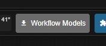
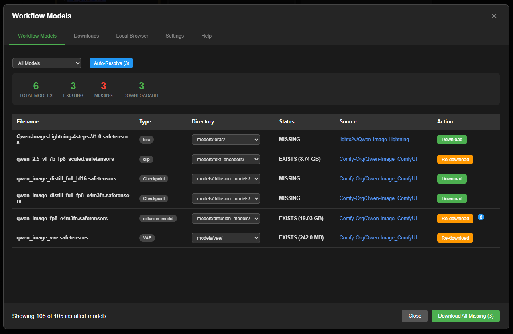
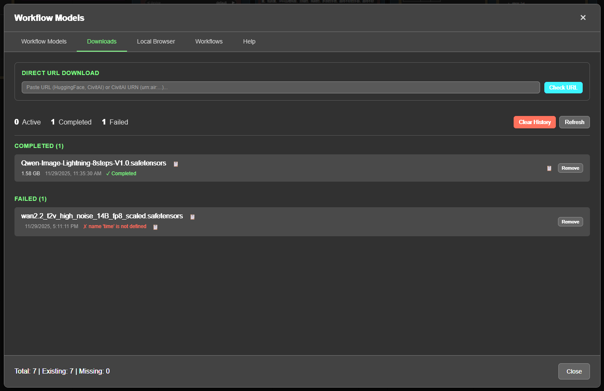
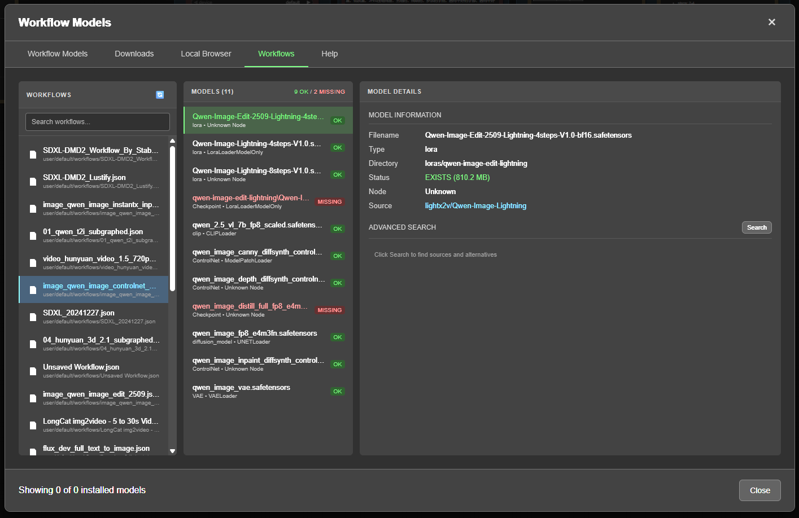
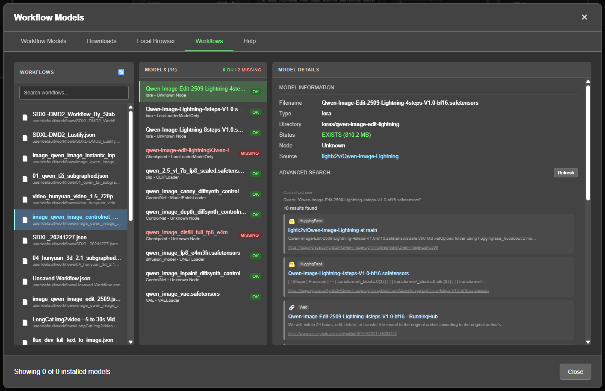
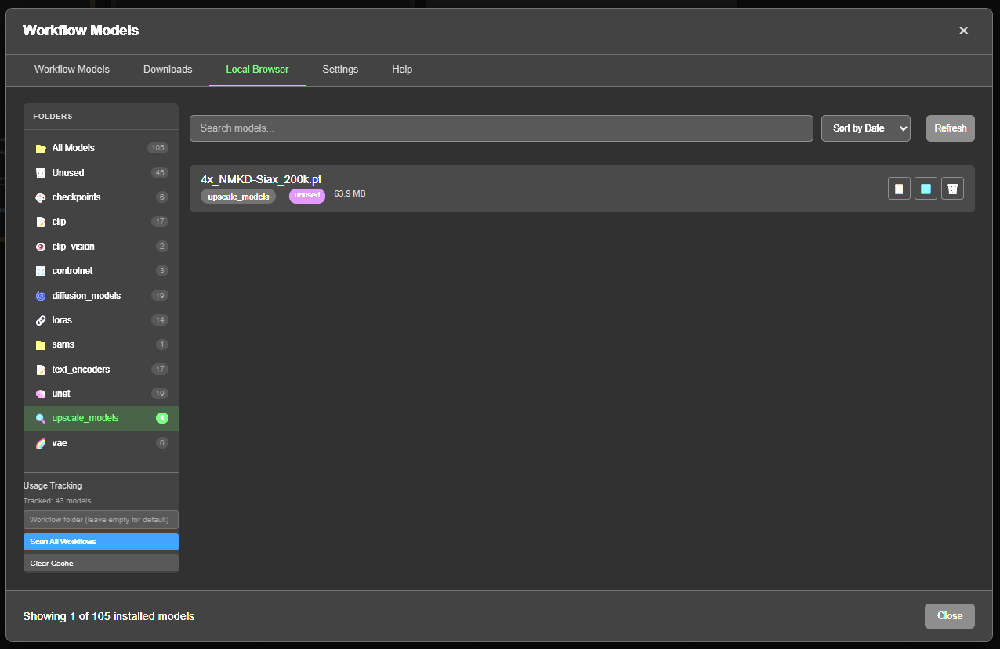
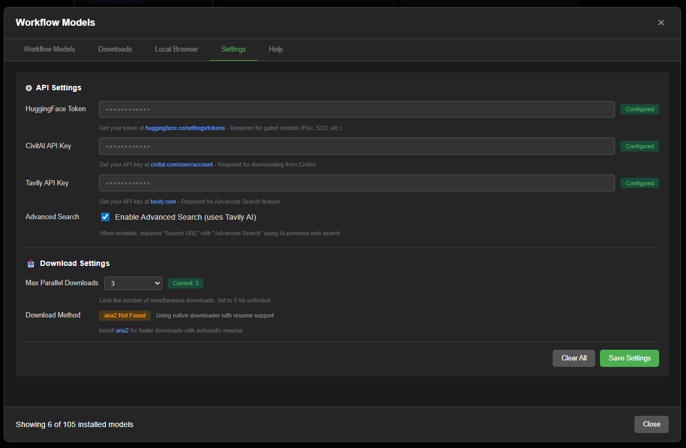
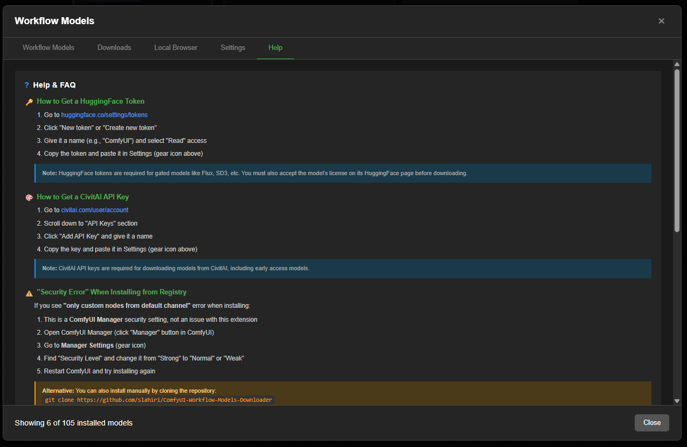

# ComfyUI Workflow Models Downloader

[](https://registry.comfy.org/publishers/slahiri/nodes/comfyui-workflow-models-downloader)
[](https://opensource.org/licenses/MIT)
[](https://www.python.org/downloads/)
[](https://github.com/slahiri/ComfyUI-Workflow-Models-Downloader/stargazers)

A powerful ComfyUI extension that automatically detects models in your workflow and helps download missing ones from HuggingFace, CivitAI, and other sources.

## Screenshots

### Menu Button
Click the **"Workflow Models"** button in the ComfyUI menu bar to open the manager.



### Workflow Models Tab
Scans your active workflow and displays all required models with their status, source, and download options. Features include filter dropdown, Auto-Resolve for bulk downloads, and one-click downloading.



### Downloads Tab
Manage all your downloads in one place. Features Direct URL Download - paste any model URL, auto-detect type and target folder, then download with one click.



### Workflows Tab
Browse saved workflow files and manage model sources:
- **3-column layout** - Workflows list, models in workflow, model details
- **Manual source entry** - Add download URLs for models with unknown sources
- **Advanced Search** - AI-powered search using Tavily to find model sources
- **Search caching** - Results persist across restarts



### Advanced Search (Tavily)
When a model source is unknown, use Advanced Search to find possible download sources from HuggingFace, CivitAI, and other sites.



### Local Browser Tab
Browse all your installed models organized by folder. Features include:
- **Folder tree sidebar** with model counts per category
- **Unused models filter** - identify models not used in any workflow
- **Usage Tracking** - scan all workflows to build usage history
- **Search, sort, and manage** with copy path, view details, and delete options



### Settings Tab
Configure API keys for HuggingFace, CivitAI, and Tavily (AI-powered search). Set max parallel downloads and view aria2 availability for faster downloads with resume support.



### Help Tab
Built-in FAQ and troubleshooting guide covering API key setup, common errors, and tips.



## Features

### Core Features
- **Auto-detect models** - Scans your active workflow for all model references
- **Smart URL detection** - Finds download URLs from multiple sources:
  - Workflow metadata (embedded URLs)
  - Popular models registry (curated list)
  - ComfyUI Manager model list
  - HuggingFace API search
  - CivitAI API search
- **One-click download** - Download missing models directly from the UI
- **Background downloads** - Downloads continue even when modal is closed
- **Progress tracking** - Real-time download progress with notifications

### v1.8.0 New Features
- **Tabbed UI** - Clean organization with 5 tabs: Workflow Models, Downloads, Local Browser, Settings, Help
- **Direct URL Download** - Paste any URL, auto-detect model type, choose directory, and download
- **Local Browser** - Browse all installed models with folder tree sidebar, search, and sort
- **Unused Models Tracking** - Identify models not used in any workflow with persistent cache
- **Scan All Workflows** - Batch scan workflow files to build usage history
- **Alternative Formats** - Auto-detect GGUF/fp16/quantized variants when model is missing
- **Dynamic Folder Types** - Supports custom folders from extra_model_paths.yaml
- **Fuzzy Matching** - Find similar models with 70% confidence threshold
- **Model Aliases** - Pattern-based matching for fp16/fp8/quantized variants
- **aria2 Integration** - 4x faster downloads with automatic resume support
- **Download Queue** - Parallel downloads with configurable limit (0-50)
- **Confidence Badges** - Visual indicator showing match quality percentage

## Installation

### Via ComfyUI Registry (Recommended)
Search for "Workflow Models Downloader" in ComfyUI Manager and click Install.

### Manual Installation
```bash
cd ComfyUI/custom_nodes
git clone https://github.com/slahiri/ComfyUI-Workflow-Models-Downloader.git
pip install -r ComfyUI-Workflow-Models-Downloader/requirements.txt
```

Restart ComfyUI after installation.

## Usage

1. Open any workflow in ComfyUI
2. Click **"Workflow Models"** button in the top menu
3. Review detected models and their status
4. Click **Download** for missing models, or **Download All Missing**

### For models without detected URLs:
- Click **Fuzzy Match** to find similar models
- Click **Search URL** to search HuggingFace and CivitAI APIs
- Or paste a direct download URL and click **Go**

### Direct URL Download:
1. Go to **Downloads** tab
2. Paste any model URL (HuggingFace, CivitAI, or direct link)
3. Click **Check URL** to auto-detect filename and type
4. Adjust filename/directory if needed
5. Click **Download**

## Supported Model Types

- Checkpoints (SD1.5, SDXL, SD3, Flux)
- Diffusion Models (Wan, LTX, HunyuanVideo)
- VAE
- LoRA / LoHa / LoKr
- Text Encoders (T5, CLIP)
- CLIP Vision
- ControlNet
- IP-Adapter
- Upscalers (ESRGAN, etc.)
- SAM / SAM2
- And more...

## Requirements

- ComfyUI
- Python 3.10+
- `requests`
- `huggingface_hub`

### Optional (for faster downloads)
- [aria2](https://aria2.github.io/) - 4x faster downloads with automatic resume support

## API Keys

For full functionality, configure these API keys in the Settings tab:

- **HuggingFace Token** - Required for gated models (Flux, SD3, etc.) - [Get token](https://huggingface.co/settings/tokens)
- **CivitAI API Key** - Required for CivitAI downloads - [Get key](https://civitai.com/user/account)
- **Tavily API Key** - Optional, enables AI-powered advanced search - [Get key](https://tavily.com)

## License

MIT License
